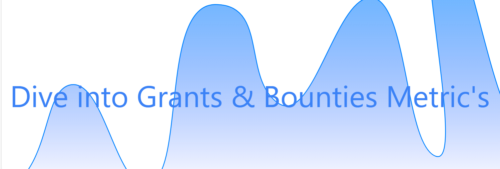

# Project "Grant's & Bounties Tracker"



## Project Description

The "Grant's & Bounties Tracker" project is developed using React, Vite, and other technologies to display various real-time metrics and charts. The system provides essential data about the activities within the TON Society organization and can operate in both light and dark modes.

## Repository Structure

The project has the following repository structure:

- `docs/`: Directory containing documentation, including `admin_guide.md`, `installation.md`, and `user_guide.md`.

- `frontend/`: Directory with the frontend source code, including components, images, and other resources.

- `parsers/`: Directory with parsers for collecting data from GitHub.

- `kubernetes/`: Directory with Kubernetes configuration files for deploying the system.

- `docker-compose.yml`: Docker Compose file for managing project containers.

## Key Components

### Frontend

- The frontend source code is located in the `frontend/src/` directory.

- Displays various metrics and charts, including information about contributors, tasks, and rewards.

- Supports light and dark themes that can be switched.

### Parsers

- Parsers for collecting data from GitHub are found in the `parsers/` directory.

- Each parser runs asynchronously and can work in multi-threaded mode.

- Data obtained by the parsers is stored in Redis for further access.

### API Server

- The API server is located in the `frontend/server.js` directory.

- Interacts with Redis to provide data to the frontend through various routes.

## Running the Project

To run the project, follow these steps:

1. Ensure you have Docker and Docker Compose installed.

2. Start the containers with the following command:

   ```bash
   docker-compose up
   ```

   This will launch Redis, the frontend, and the parser container.

3. Once the parsers have completed their work, the frontend will be accessible at [http://localhost:5173](http://localhost:5173).

## Documentation

Additional instructions and guides are available in the `docs/` directory:

- [Administrator's Guide](docs/admin_guide.md)
- [Installation Guide](docs/installation.md)
- [User Guide](docs/user_guide.md)

## Contact Information

Project Authors:

- delovoyhomie
- seriybeliy11

Reach out to us:

- Telegram: @delovoyhomie
- Telegram: @acaedb

## License

This project is distributed under the TON Society license. All rights reserved.